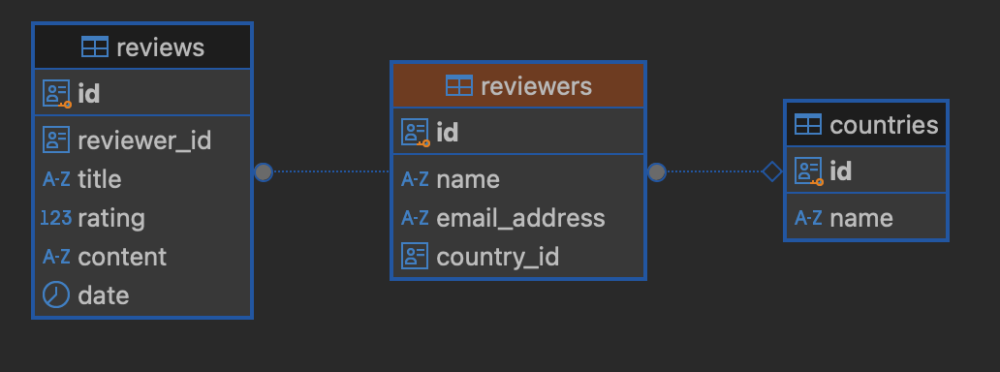
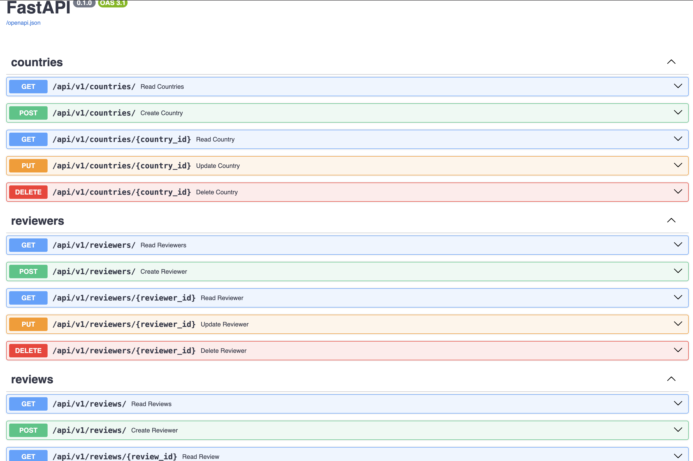

# Reviews

A small project that exemplifies a data pipeline that ingests Reviews data into a database. The ingested data can be manipulated through API.

## Prerequisites

- [Python 3.12.4](https://www.python.org/downloads/)
- [Poetry](https://python-poetry.org/)
- [Docker](https://www.docker.com/)

### Environment variables

This service is using the [python-dotenv](https://pypi.org/project/python-dotenv/) module to handle environment variables and easily load configuration settings from a `.env` file.

To setup local environment variables copy and rename the `.env.example` file to `.env`.


## How to run with Docker

This assumes your `.env` file lives in the repository root folder

```
cd docker
# make sure to start with a clean slate
docker compose down --remove-orphans 
docker compose up --build --force-recreate -d
```

## Architecture

The main objective of this project is to import data from a CSV file into a database and provide means to manipulate the data through API.

To simulate a real world scenario, the CSV was uploaded to a cloud object storage in S3 AWS. The data can be accessed [here](https://dev-eu.s3.eu-north-1.amazonaws.com/dataops_tp_reviews.csv).


In order to achieve the main goals of the project, the logic was divided into two main components: the API service and the Data Processing service, each handling specific responsibilities to ensure data ingestion and API functionality.

### Data Processing

The data processing pipeline handles these main tasks:

* Stream the content of the CSV file from S3.
* Validatse the integrity of the data.
* Write the data to the database.

The validation is happening using the Pydantic library with some custom field logic, see [here](https://github.com/NicolaePopovici/reviews-pipeline/blob/main/app/data/schema.py). Extra conditions are needed based on the business logic.

At this point, the rows that are not valid are only logged and a separate logic for handling these use cases is needed.

#### Database

For our purpose, it was decided to use the object-relational database PostgreSQL that could handle the potentially high volume of data and the complex queries from the APIs

The data is normalized and structured in three tables:

* Countries
* Reviewers
* Reviews

The data migration is handled through alembic.



#### Data Processin Future Improvements

* Tests
* Data versioning
* Handling multiple files
* Handling updates/deletes to the current files
* Additional data/schema validation
* Processing in batches
* Adding multiple *workers*
* Extra observability and alerts
* Separate queue for invalid data
* Exponential retries
* Backup
* CI

### API

The API endpoints were implemented using the FastAPI endpoints. After running the docker-compose command, the swagger page with the documentation can be found here: `http://localhost:8000/docs`



Validation of the data was done using the Pydantic library.

#### API Future Improvements

* Tests
* Additional data validation
* Consistent schema definition
* Observability and alerts
* Authentification
* Caching
* Change offset to keyset-based pagination
* Custom error messages
* CI


### Testing

Due to limited available time, this project did not follow the Test Driven Development methodology. Adding tests is essential before any deployment to a production environment.

Due to the project's structure, besides the unit tests, it is recommended to add integration tests to ensure the communication between various parts of the system works as expected.

### Costs

Two main factors will determine the cost of this project: 

* The quantity of data that we expect to handle
* The number of requests

In addition to these variable costs, there are also fixed costs associated with the compute resources required to run the applications, as well as the database instances that support them.


### Project Requirements

The architecture described is suitable for a basic demo running on a local system, but significant adjustments are needed to make it production-ready. These adjustments depend on having clear project requirements and understanding the anticipated load.

For a list of necesarry imporvements, see the Future Improvements section for each component.